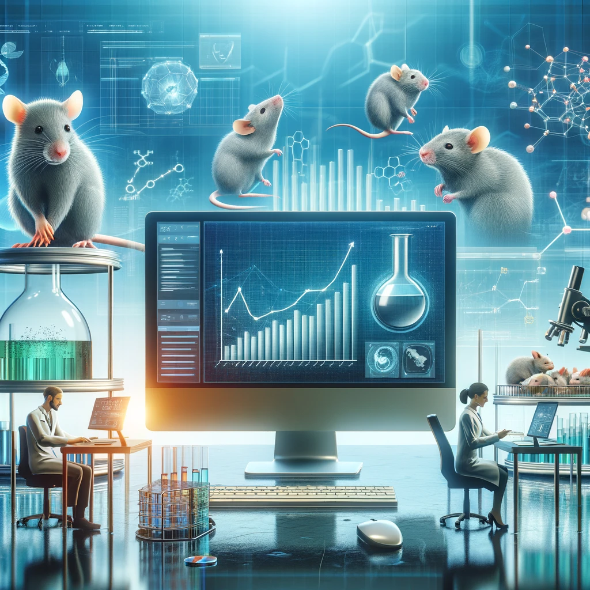

# SCC Treatment Analysis with Matplotlib



## Background
Pymaceuticals, Inc., a pioneering pharmaceutical company, has recently embarked on a crucial study focusing on squamous cell carcinoma (SCC), a common form of skin cancer. In their latest animal study, they explored the efficacy of various drug regimens, including their primary drug, Capomulin, on 249 mice with SCC tumors over a 45-day period. As a senior data analyst, my role involves analyzing this extensive data to compare the performance of Capomulin against other treatments and providing comprehensive insights through tables, figures, and a summary of the study results. This study is a significant step in Pymaceuticals' mission to advance cancer treatment and improve patient outcomes.
## Objective
This project aims to meticulously analyze and visualize data from Pymaceuticals, Inc.'s recent squamous cell carcinoma treatment study, leveraging Python, Pandas, and Matplotlib. The key objectives, essential for providing insightful conclusions, are outlined as follows: 
### 1. **Prepare the Data**
* Execute package dependencies and data imports.
* Merge the `mouse_metadata` and `study_results` DataFrames.
* Identify and handle any duplicate mouse IDs.
* Use the cleaned DataFrame for subsequent analyses.

### 2. **Generate Summary Statistics**
* Develop a DataFrame detailing summary statistics for each drug regimen, including mean, median, variance, standard deviation, and SEM of tumor volume.

### 3. **Create Bar and Pie Charts**
* Utilize Pandas and Matplotlib to generate two identical bar charts showing time points for each drug regimen.
* Create two identical pie charts displaying the gender distribution of mice using both Pandas and Matplotlib methods.

### 4. **Quartiles, Outliers, and Box Plot Analysis**
* Analyze the final tumor volume for key treatments: Capomulin, Ramicane, Infubinol, and Ceftamin.
* Calculate quartiles, IQR, and identify potential outliers.
* Generate a box plot for each treatment group, highlighting any outliers.

### 5. **Line Plot and Scatter Plot Creation**
* Select a Capomulin-treated mouse and plot tumor volume versus time point.
* Produce a scatter plot illustrating tumor volume versus mouse weight for the Capomulin regimen.

### 6. **Correlation and Regression Calculation**
* Determine the correlation coefficient between mouse weight and average tumor volume for Capomulin-treated mice.
* Fit a linear regression model and overlay this on the scatter plot.

### 7. **Final Analysis**
* Compile and submit all findings, including charts, plots, and statistical analyses.
## Data
The dataset for this project comprises two CSV files, providing comprehensive information on the animal study conducted by Pymaceuticals, Inc. These datasets encompass detailed records of the mice involved in the study, their treatment regimens, and the progression of the treatment effects. Data generated by [Mockaroo](https://mockaroo.com/), LLC (2022). Realistic Data Generator.
### Mouse Metadata
| Column Name  | Description                                       |
|--------------|---------------------------------------------------|
| Mouse ID     | Unique identifier for each mouse.                 |
| Drug Regimen | Name of the drug regimen the mouse is receiving.  |
| Sex          | Biological sex of the mouse (Male/Female).        |
| Age_months   | Age of the mouse in months.                       |
| Weight (g)   | Weight of the mouse in grams.                     |

### Study Results
| Column Name        | Description                                             |
|--------------------|---------------------------------------------------------|
| Mouse ID           | Unique identifier for each mouse.                       |
| Timepoint          | Specific time point of measurement during the study.    |
| Tumor Volume (mm3) | Measured tumor volume in cubic millimeters.             |
| Metastatic Sites   | Number of sites where metastasis is observed.           |
## Implementation
In the implementation section of this project, we delve into the practical aspects of our analysis, detailing the specific steps and methodologies employed to extract, process, and interpret data from the squamous cell carcinoma study conducted by Pymaceuticals, Inc.
### Prepare the Data
#### Data Import and Merging
```python
%config InlineBackend.figure_format = 'svg'

# Dependencies and Setup
import matplotlib.pyplot as plt
import pandas as pd
import scipy.stats as st

# Study data files
mouse_metadata_path = "data/Mouse_metadata.csv"
study_results_path = "data/Study_results.csv"

# Read the mouse data and the study results
mouse_metadata = pd.read_csv(mouse_metadata_path)
study_results = pd.read_csv(study_results_path)

# Combine the data into a single dataset
combined_df = pd.merge(study_results, mouse_metadata, how='left', on='Mouse ID')

# Display the data table for preview
combined_df.head()
```
Essential libraries are imported, and mouse metadata and study results are read and merged into one DataFrame for analysis. 
#### Unique Mice Count
```python
# Checking the number of mice.
combined_df['Mouse ID'].nunique()
```
The total number of unique mice are calculated in the combined dataset.
#### Identifying Duplicate Mice
```python
# Getting the duplicate mice by ID number that shows up for Mouse ID and Timepoint. 
mice_duplicate = combined_df[combined_df[['Mouse ID', 'Timepoint']].duplicated()]['Mouse ID'].unique()
mice_duplicate
```
Mice with duplicate entries based on both `Mouse ID` and `Timepoint` are identified in the combined dataset.
#### Extracting Duplicate Mouse Data
```python
# Get all the data for the duplicate mouse ID. 
mice_duplicate_df = combined_df[combined_df['Mouse ID'].isin(mice_duplicate)]
mice_duplicate_df
```
All data associated with the identified duplicate mouse IDs are put in a DataFrame.
#### Creating a Clean DataFrame
```python
# Create a clean DataFrame by dropping the duplicate mouse by its ID.
clean_df = combined_df[~combined_df['Mouse ID'].isin(mice_duplicate)]
clean_df.head()
```
A clean DataFrame is generated by removing all entries of the duplicate mouse.
#### Verifying Unique Mice in Clean Data
```python
# Checking the number of mice in the clean DataFrame.
clean_df['Mouse ID'].nunique()
```
Confirming the count of unique mice in the cleaned DataFrame post-duplication removal.  
### Generate Summary Statistics 
#### Summary Statistics Table Creation
```python
# Generate a summary statistics table of mean, median, variance, standard deviation, and SEM of the tumor volume for each regimen

# Use groupby and summary statistical methods to calculate the following properties of each drug regimen: 
# mean, median, variance, standard deviation, and SEM of the tumor volume. 
mean = clean_df.groupby(['Drug Regimen'])['Tumor Volume (mm3)'].mean()
median =  clean_df.groupby(['Drug Regimen'])['Tumor Volume (mm3)'].median()
variance =  clean_df.groupby(['Drug Regimen'])['Tumor Volume (mm3)'].var()
std =  clean_df.groupby(['Drug Regimen'])['Tumor Volume (mm3)'].std()
sem =  clean_df.groupby(['Drug Regimen'])['Tumor Volume (mm3)'].sem()

# Assemble the resulting series into a single summary DataFrame.
summary_statistics_df = pd.DataFrame({
    'Mean Tumor Volume': mean,	
    'Median Tumor Volume': median,	
    'Tumor Volume Variance': variance,
    'Tumor Volume Std. Dev.': std,
    'Tumor Volume Std. Err.': sem
})

# Display DataFrame
summary_statistics_df
```
A summary statistics table for each drug regimen is created, including mean, median, variance, standard deviation, and SEM of the tumor volume, using grouped data from the clean DataFrame.
#### Aggregated Summary Statistics Table
```python
# Generate a summary statistics table of mean, median, variance, standard deviation, 
# and SEM of the tumor volume for each regimen

# Using the aggregation method, produce the same summary statistics in a single line.
clean_df.groupby(['Drug Regimen'])[['Tumor Volume (mm3)']].agg(['mean', 'median', 'var', 'std', 'sem'])
```
The same summary statistics table for tumor volume by each drug regimen is created in one line, using the aggregation method to compute mean, median, variance, standard deviation, and SEM.
### Create Bar and Pie Charts
#### Mice Count per Drug Regimen Plot with Pandas
```python
# Count the number of mice tested for each 'Drug Regimen'
drug_regimen_mice_count = clean_df['Drug Regimen'].value_counts()

# Generate a bar plot showing the number of mice tested for each drug regimen using Pandas.
drug_regimen_mice_count.plot(kind='bar', xlabel='Drug Regimen', ylabel='Number of Mice Tested')
```
Counts the number of mice tested for each drug regimen and visualizes the data with a bar plot, using Pandas.
#### Mice Count per Drug Regimen Plot with Pyplot
```python
# Set up the x-axis values (drug regimen names) and the heights (number of mice)
x_values = drug_regimen_mice_count.index
y_values = drug_regimen_mice_count.values

# Generate a bar plot showing the number of mice tested for each drug regimen using pyplot.
plt.bar(x_values, y_values)

# Adding labels
plt.xlabel('Drug Regimen')
plt.ylabel('Number of Mice Tested')

# Rotate x-axis labels
plt.xticks(rotation=90)

# Display the plot
plt.show()
```
The same bar plot is created but this time using Matplotlib's `pyplot`.
#### Gender Distribution Pie Chart Using Pandas
```python
# Generate a pie plot showing the distribution of female versus male mice using Pandas
mouse_gender_distribution = clean_df['Sex'].value_counts()
mouse_gender_distribution.plot(kind='pie', autopct='%1.1f%%')

# Display the plot
plt.show()
```
Create a pie chart to visualize the distribution of female and male mice in the study, using Pandas' built-in plotting capabilities with percentage annotations.
#### Gender Distribution Pie Chart Using Pyplot
```python
# Create labels for the pie chart sections
labels = mouse_gender_distribution.index

# Define the sizes of each section of the pie chart
sizes = mouse_gender_distribution.values
# Generate a pie plot showing the distribution of female versus male mice using pyplot
plt.pie(sizes, labels=labels, autopct='%1.1f%%')

# Add ylabel
plt.ylabel('Sex')

# Display the plot
plt.show()
```
The same pie chart is created using Matplotlib's `pyplot`. 
### Quartiles, Outliers, and Box Plot Analysis
#### Final Tumor Volume Calculation for Select Treatments
```python
# Calculate the final tumor volume of each mouse across four of the treatment regimens:  
# Capomulin, Ramicane, Infubinol, and Ceftamin

# Start by getting the last (greatest) timepoint for each mouse
last_timepoint = clean_df.groupby('Mouse ID')['Timepoint'].max().reset_index()

# Merge this group df with the original DataFrame to get the tumor volume at the last timepoint
merged_df = last_timepoint.merge(clean_df, on=['Mouse ID', 'Timepoint'], how='left')
```
Determine the final tumor volume for each mouse in the Capomulin, Ramicane, Infubinol, and Ceftamin regimens by first finding the last timepoint for each mouse and the merging this data with the original DataFrame to obtain tumor volumes at these final timepoints. 
#### Tumor Volume Analysis for Key Treatments
```python
# List of treatments to analyze
treatment_list = ['Capomulin', 'Ramicane', 'Infubinol', 'Ceftamin']

# Empty list to store tumor volume data 
tumor_vol_list = []

# Loop over each treatment 
for treatment in treatment_list:
    
    # Locate the rows which contain mice on each drug and get the tumor volumes
    final_tumor_vol = merged_df.loc[merged_df['Drug Regimen'] == treatment, 'Tumor Volume (mm3)']
    
    # Add subset to tumor volume list
    tumor_vol_list.append(final_tumor_vol)
    
    # Calculate the IQR and determine outliers
    quartiles = final_tumor_vol.quantile([.25, .5, .75])
    lowerq = quartiles[0.25]
    upperq = quartiles[0.75]
    iqr = upperq - lowerq
    
    # Determine outliers using upper and lower bounds
    lower_bound = lowerq - (1.5 * iqr)
    upper_bound = upperq + (1.5 * iqr)
    outliers = final_tumor_vol.loc[(final_tumor_vol < lower_bound) | (final_tumor_vol > upper_bound)]
    
    print(f"{treatment}'s potential outliers: {outliers}")
```
Analyzes tumor volumes for Capomulin, Ramicane, Infubinol, and Ceftamin treatments. This involves calculating tumor volumes, Interquartile Range (IQR), and identifying potential outliers for each treatment, storing the results in a list for further examination.
#### Box Plot of Tumor Volume by Treatment
```python
# Generate a box plot that shows the distrubution of the tumor volume for each treatment group.
fig1, ax1 = plt.subplots()
ax1.set_ylabel('Final Tumor Volume (mm3)')
ax1.boxplot(tumor_vol_list, flierprops=dict(markerfacecolor='red', markersize=12))
ax1.set_xticklabels(treatment_list)
plt.show()
```
Creates a box plot to visualize the distribution of final tumor volumes across the treatment groups Capomulin, Ramicane, Infubinol, and Ceftamin. The plot highlights potential outliers with red markers for easier identification.
### Line Plot and Scatter Plot Creation
#### Line Plot for Capomulin Treatment of Mouse l509
```python
# Filter the DataFrame for mouse ID l509
mouse_data = clean_df[clean_df['Mouse ID'] == 'l509']

# Generate a line plot of tumor volume vs. time point for a mouse treated with Capomulin
plt.plot(mouse_data['Timepoint'], mouse_data['Tumor Volume (mm3)'])

# Add labels and title
plt.xlabel('Timepoint (days)')
plt.ylabel('Tumor Volume (mm3)')
plt.title('Capmulin treatment of mouse l509')

# Display the plot
plt.show()
```
Displays the progression of tumor volume over time for mouse l509, treated with Capomulin, using a line plot.
#### Scatter Plot of Tumor Volume vs. Mouse Weight for Capomulin
```python
# Filter the DataFrame for the Capomulin regimen
capomulin_data = clean_df[clean_df['Drug Regimen'] == 'Capomulin']

# Calculate the average tumor volume for each mouse 
average_tumor_volume = capomulin_data.groupby('Mouse ID').agg(
    Average_Tumor_Volume=('Tumor Volume (mm3)', 'mean'),
    Weight=('Weight (g)', 'mean') 
)

# Generate a scatter plot of average tumor volume vs. mouse weight for the Capomulin regimen
plt.scatter(average_tumor_volume['Weight'], average_tumor_volume['Average_Tumor_Volume'])

# Add labels
plt.xlabel('Weight (g)')
plt.ylabel('Average Tumor Volume (mm3)')

# Display the plot
plt.show()
```
Presents a scatter plot illustrating the relationship between average tumor volume and mouse weight for mice treated with the Capomulin regimen. 
### Correlation and Regression Calculation
#### Correlation and Regression Analysis for Capomulin Treatment
```python
# Calculate the Pearson correlation coefficient 
correlation = st.pearsonr(average_tumor_volume['Weight'], average_tumor_volume['Average_Tumor_Volume'])
print(f"The correlation between mouse weight and the average tumor volume is {correlation[0]:.2f}")

# Perform linear regression
(slope, intercept, rvalue, pvalue, stderr) = st.linregress(average_tumor_volume['Weight'], average_tumor_volume['Average_Tumor_Volume'])

# Calculate regression values
regress_values = average_tumor_volume['Weight'] * slope + intercept

# Create a scatter plot
plt.scatter(average_tumor_volume['Weight'], average_tumor_volume['Average_Tumor_Volume'])

# Plot the linear model on top of the scatter plot
plt.plot(average_tumor_volume['Weight'], regress_values, "r-")

# Add labels
plt.xlabel('Weight (g)')
plt.ylabel('Average Tumor Volume (mm3)')

# Display the plot
plt.show()
```
Calculates the Pearson correlation coefficient between mouse weight and average tumor volume for Capomulin treatment. It also performs linear regression analysis, plotting the resulting regression line over a scatter plot to visually represent the relationship.
## Final Analysis
In this section, we present a focused analysis of Pymaceuticals' study results, examining the effectiveness of various drug regimens on tumor reduction. Utilizing statistical summaries and visual data, we assess treatment impacts, scrutinize potential outliers, and explore key correlations. This analysis aims to distill critical insights from the data, providing clear conclusions about the drug efficacies observed in the study.
        